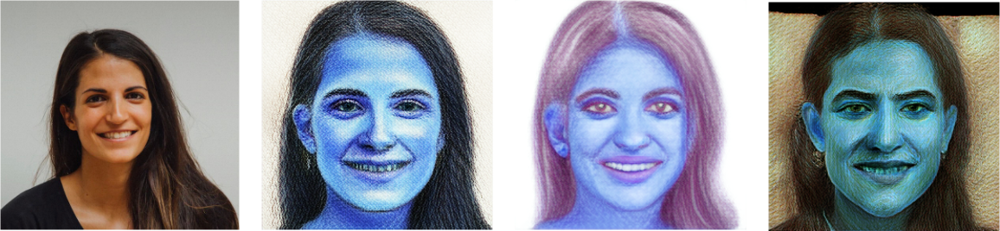

# mp-face-stylizer
Python Face Stylizer Program based on [MediaPipe Solution](https://developers.google.com/mediapipe/solutions/vision/face_stylizer).


Features:
+ No GPU needed, running on CPU, with FPS of 1~3
+ Support 3 types of style:
	+ Color Sketch
	+ Color Ink
	+ Oil Painting

+ Support 3 types of inputs:
	+ A single image
	+ A video
	+ The camera

## How to run

### Installation
Installing `mp-face-stylizer` on pypi:
```
pip install mp-face-stylizer
```
### Download Mediapipe Models
For now, you can download models from Mediapipe site:
```bash
wget https://storage.googleapis.com/mediapipe-models/face_stylizer/blaze_face_stylizer/float32/latest/face_stylizer_color_sketch.task
wget https://storage.googleapis.com/mediapipe-models/face_stylizer/blaze_face_stylizer/float32/latest/face_stylizer_color_ink.task
wget https://storage.googleapis.com/mediapipe-models/face_stylizer/blaze_face_stylizer/float32/latest/face_stylizer_oil_painting.task
```

### Run Demo
Test with an image:
```bash
mp_face_stylizer img -i /path/to/img -m /path/to/face_stylizer_color_sketch.task -o output.jpg
```

Test with a video:
```bash
mp_face_stylizer video -i /path/to/video -m /path/to/face_stylizer_color_sketch.task -o output.mp4
```

Test with the camera:
```bash
mp_face_stylizer camera -m /path/to/face_stylizer_color_sketch.task
```

## TODO
- [ ] add model auto download pipeline
- [ ] speedup running fps
- [x] show fps
